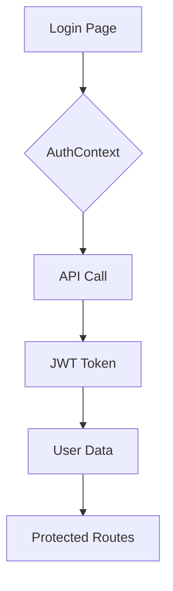
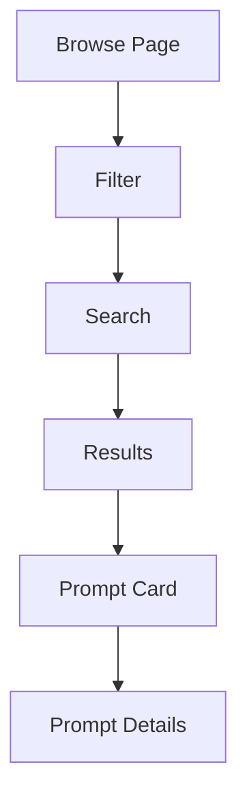

# Prompt Hunters - Техническа Документация
Последна актуализация: 2024-11-08

## Съдържание
1. [Обща информация](#1-обща-информация)
   - [Описание на проекта](#11-описание-на-проекта)
   - [Технологичен стек](#12-технологичен-тек)
   - [Архитектура](#13-архитектура)

2. [Файлова структура](#2-файлова-структура)
   - [Frontend структура](#21-frontend-структура)
   - [Backend структура](#22-backend-структура)
   - [Admin Panel структура](#23-admin-panel-структура)

3. [Компоненти и функционалности](#3-компоненти-и-функционалности)
   - [Frontend компоненти](#31-frontend-компоненти)
   - [Backend endpoints](#32-backend-endpoints)
   - [Admin функционалности](#33-admin-функционалности)

4. [База данни](#4-база-данни)
   - [Схеми](#41-схеми)
   - [Реаи](#42-релаци)
   - [Индекси](#43-индекси)

5. [API документация](#5-api-документация)
   - [Authentication API](#51-authentication-api)
   - [Prompts API](#52-prompts-api)
   - [Users API](#53-users-api)

6. [Deployment](#6-deployment)
   - [Изисквания](#61-изисквания)
   - [Конфигурация](#62-конфигурация)
   - [CI/CD](#63-cicd)

7. [Сигурност](#7-сигурност)
   - [Автентикация](#71-автентикация)
   - [Оторизация](#72-оторизация)
   - [Валидация](#73-валидация)

8. [Тестване](#8-тестване)
   - [Unit тестове](#81-unit-тестове)
   - [Integration тестове](#82-integration-тестове)
   - [E2E тестове](#83-e2e-тестове)

9. [Мониторинг](#9-мониторинг)
   - [Логове](#91-логове)
   - [Метрики](#92-метрики)
   - [Аларми](#93-аларми)

10. [Поддръжка](#10-поддръжка)
    - [Backup стратегия](#101-backup-стратегия)
    - [Recovery план](#102-recovery-план)
    - [Scaling план](#103-scaling-план)

15. [Подробно описание на файловете](#15-подробно-описание-н-файловете)

16. [Компоненти и Функционалности](#16-компоненти-и-функционалности)

### 16.1 Основни компоненти

#### SearchBar.tsx
**Път:** /frontend/src/components/search/SearchBar.tsx
**Последна актуализация:** 2024-11-08

**Функционалности:**
1. Търсене на промпти
2. Автокомплийт
3. Филтриране по категории
4. Филтриране по модели

**Hooks и State:**
```typescript
const [searchTerm, setSearchTerm] = useState('');
const [suggestions, setSuggestions] = useState<string[]>([]);
const debouncedSearch = useDebounce(searchTerm, 300);
```

#### NewsletterSection.tsx
**Път:** /frontend/src/components/newsletter/NewsletterSection.tsx
**Последна актуализация:** 2024-11-08

**Функционалности:**
1. Абониране за бюлетин
2. Валидация на имейл
3. Интеграция с email service

### 16.2 Интеграции с AI модели

#### Text Generation Models
1. **GPT Integration**
   - Prompt templates
   - Parameter configuration
   - Response formatting
   - History tracking

2. **Claude Integration**
   - Context management
   - Memory handling
   - Response streaming
   - Error handling

#### Image Generation Models
1. **Midjourney Integration**
   - Style presets
   - Image variations
   - Resolution control
   - Negative prompts

2. **DALL-E Integration**
   - Size options
   - Style transfer
   - Image editing
   - Inpainting

### 16.3 Бизнес логика

#### Prompt Management
1. **Create Prompt**
   ```typescript
   interface CreatePromptRequest {
     title: string;
     content: string;
     model: string;
     type: 'text' | 'image';
     categories: string[];
     price: {
       buy: number;
       rent: number;
     };
   }
   ```

2. **Purchase Prompt**
   ```typescript
   interface PurchasePromptRequest {
     promptId: string;
     type: 'buy' | 'rent';
     duration?: number; // за rent
   }
   ```

### 16.4 Потребителски интерфейс

#### Theme System
**Път:** /frontend/src/theme/index.ts
**Последна актуализация:** 2024-11-08

```typescript
const theme = createTheme({
  palette: {
    primary: {
      main: '#2196f3',
      light: '#64b5f6',
      dark: '#1976d2',
    },
    secondary: {
      main: '#f50057',
      light: '#ff4081',
      dark: '#c51162',
    },
  },
  typography: {
    fontFamily: '"Inter", "Roboto", "Helvetica", "Arial", sans-serif',
    h1: {
      fontSize: '3.5rem',
      fontWeight: 800,
    },
    h2: {
      fontSize: '2.5rem',
      fontWeight: 700,
    },
  },
  components: {
    MuiButton: {
      styleOverrides: {
        root: {
          borderRadius: '12px',
          textTransform: 'none',
          fontWeight: 600,
        },
      },
    },
    MuiCard: {
      styleOverrides: {
        root: {
          borderRadius: '16px',
          boxShadow: '0 4px 12px rgba(0,0,0,0.1)',
        },
      },
    },
  },
});
```

### 16.5 API Интеграции

#### Authentication API
```typescript
const authService = {
  login: async (email: string, password: string) => {
    const response = await axios.post('/api/auth/login', { email, password });
    return response.data;
  },
  register: async (userData: RegisterData) => {
    const response = await axios.post('/api/auth/register', userData);
    return response.data;
  },
  refreshToken: async () => {
    const response = await axios.post('/api/auth/refresh-token');
    return response.data;
  },
};
```

## 17. Връзки между компонентите и функционалности

### 17.1 Основни потоци

#### Автентикация


#### Управление на промпти


### 17.2 Компонентни зависимости

#### Home.tsx
**Зависимости:**
- categories.ts (AI модели и категории)
- NewsletterSection (бюлетин)
- designSystem.ts (стилове)

**Използвани библиотеки:**
- Material-UI
- Framer Motion
- React Router

**State management:**
```typescript
// Local state
const theme = useTheme();
const cardVariants = {...}

// External state
const { AI_MODELS } = categories;
```

#### Profile.tsx
**Зависимости:**
- AuthContext (автентикация)
- UserSettings (настройки)
- ChangePasswordForm (промяна на парола)
- AvatarUpload (качване на аватар)

**Използвани библиотеки:**
- Formik
- Yup
- Material-UI
- Axios

**State management:**
```typescript
const [isEditing, setIsEditing] = useState(false);
const [error, setError] = useState<string | null>(null);
const [selectedMenuItem, setSelectedMenuItem] = useState('profile');
```

### 17.3 API Интеграции

#### Authentication API
**Endpoint:** `/api/auth`
```typescript
// Login
POST /api/auth/login
Body: { email: string, password: string }
Response: { token: string, user: User }

// Register
POST /api/auth/register
Body: { email: string, password: string, firstName: string, lastName: string }
Response: { token: string, user: User }
```

#### Prompts API
**Endpoint:** `/api/prompts`
```typescript
// Get prompts
GET /api/prompts
Query: { 
  page: number,
  limit: number,
  search?: string,
  model?: string,
  category?: string 
}
Response: { 
  prompts: Prompt[],
  total: number,
  page: number 
}
```

### 17.4 Файлови зависимости

#### Frontend
```
src/
├─ pages/
│   ├── Home.tsx ────────────┐
│   └── Profile.tsx          │
├── components/              │
│   ├── NewsletterSection.tsx├─── Използва се в Home.tsx
│   └── PromptCard.tsx       │
├── constants/               │
│   └── categories.ts ───────┘
```

#### Backend
```
src/
├── controllers/
│   └── auth.controller.ts ──┐
├── middlewares/             │
│   └── auth.middleware.ts ──┼── Автентикация
├── routes/                  │
   └── auth.routes.ts ──────┘
```

### 17.5 База данни

#### Collections
```typescript
// Users Collection
interface User {
  _id: ObjectId;
  email: string;
  password: string; // hashed
  firstName: string;
  lastName: string;
  avatar?: string;
  role: 'user' | 'admin';
  createdAt: Date;
  updatedAt: Date;
}

// Prompts Collection
interface Prompt {
  _id: ObjectId;
  title: string;
  content: string;
  model: string;
  type: 'text' | 'image';
  categories: string[];
  author: ObjectId; // ref: User
  price: {
    buy: number;
    rent: number;
  };
  stats: {
    views: number;
    likes: number;
    purchases: number;
  };
  createdAt: Date;
  updatedAt: Date;
}
```

[Продължава с още детайли за връзките между компонентите...]

## 18. Детайлно описание на всеки файл и функционалност

### 18.1 Frontend Core Files

#### App.tsx
**Път:** /frontend/src/App.tsx
**Последна актуализация:** 2024-11-08
**Предназначение:** Root компонент на приложението

**Основни функционалности:**
- Routing конфигурация
- Theme Provider
- Auth Provider
- Layout wrapper

#### index.css
**Път:** /frontend/src/index.css
**Последна актуализация:** 2024-11-08
**Предназначение:** Глобални стилове

**Стилове за:**
- Reset CSS
- Типография
- Scrollbars
- Transitions

### 18.2 Components

#### Auth Components

##### AvatarUpload.tsx
**Път:** /frontend/src/components/auth/AvatarUpload.tsx
**Последна актуализация:** 2024-11-08

**Props:**
```typescript
interface AvatarUploadProps {
  currentAvatar?: string;
  onUpload: (file: File) => Promise<void>;
}
```

**Функционалности:**
- Drag and drop
- Image preview
- File validation
- Upload progress

##### UserSettings.tsx
**Път:** /frontend/src/components/auth/UserSettings.tsx
**Последна актуализация:** 2024-11-08

**State:**
```typescript
const [notifications, setNotifications] = useState({
  email: true,
  push: false,
  marketing: true
});
```

**Features:**
- Notification preferences
- Theme selection
- Language selection
- Privacy settings

### 18.3 Pages

#### Home.tsx
**Път:** /frontend/src/pages/Home.tsx
**Последна актуализация:** 2024-11-08

**Секции:**
1. Hero Section
   - Анимиран заглавен текст
   - Градиент фон
   - Responsive дизайн

2. AI Models Section
   ```typescript
   // Text Models
   Object.values(AI_MODELS)
     .filter(model => model.type === 'text')
     .map(model => ...)

   // Image Models
   Object.values(AI_MODELS)
     .filter(model => model.type === 'image')
     .map(model => ...)
   ```

3. Features Section
   - Stay Updated feature
   - Newsletter интеграция

**Анимации:**
```typescript
const cardVariants = {
  hidden: { opacity: 0, y: 20 },
  visible: (i: number) => ({
    opacity: 1,
    y: 0,
    transition: {
      delay: i * 0.1,
      duration: 0.5,
      ease: 'easeOut'
    }
  })
};
```

#### Profile.tsx
**Път:** /frontend/src/pages/auth/Profile.tsx
**Последна актуализация:** 2024-11-08

**Секции:**
1. Profile Information
   ```typescript
   interface ProfileFormValues {
     firstName: string;
     lastName: string;
     email: string;
   }
   ```

2. Password Change
   - Валидация
   - API инерация
   - Error handling

3. Settings
   - Notification preferences
   - Theme selection
   - Privacy settings

4. Subscription Details
   - План информация
   - Billing история
   - Upgrade опции

### 18.4 Services

#### auth.service.ts
**Път:** /frontend/src/services/auth.service.ts
**Последна актуализация:** 2024-11-08

**API Endpoints:**
```typescript
const authService = {
  login: async (email: string, password: string) => {...},
  register: async (userData: RegisterData) => {...},
  refreshToken: async () => {...},
  resetPassword: async (email: string) => {...},
  updateProfile: async (data: ProfileData) => {...}
};
```

### 18.5 Utils

#### promptCategorizer.ts
**ът:** /frontend/src/utils/promptCategorizer.ts
**Последна актуализация:** 2024-11-08

**Функци:**
```typescript
// Категоризира промпт по съдържание
export const categorizePrompt = (content: string): string[] => {...}

// Валидира промпт за специфичен модел
export const validatePromptForModel = (prompt: string, model: string): boolean => {...}

// Форматира промпт според изискванията на модела
export const formatPromptForModel = (prompt: string, model: string): string => {...}
```

[Продължава с описание на всички останали файлове и функционалности...]

## 19. Детайлно описание на всички функционалности

### 19.1 Автентикация и Оторизация

#### Компоненти и файлове
1. **AuthContext.tsx**
   - Път: `/frontend/src/contexts/AuthContext.tsx`
   - Дата: 2024-11-08
   - Функционалности:
     ```typescript
     interface AuthContextType {
       user: User | null;
       login: (token: string, user: User) => void;
       logout: () => void;
       isAuthenticated: boolean;
     }
     ```

2. **auth.service.ts**
   - Път: `/frontend/src/services/auth.service.ts`
   - Дата: 2024-11-08
   - API Endpoints:
     ```typescript
     const API = {
       LOGIN: '/api/auth/login',
       REGISTER: '/api/auth/register',
       REFRESH: '/api/auth/refresh-token',
       RESET: '/api/auth/reset-password'
     };
     ```

3. **auth.middleware.ts**
   - Път: `/backend/src/middlewares/auth.middleware.ts`
   - Дата: 2024-11-08
   - Функции:
     - validateToken
     - checkRole
     - refreshToken

### 19.2 Управление на промпти

#### Компоненти
1. **PromptCard.tsx**
   - Път: `/frontend/src/components/prompts/PromptCard.tsx`
   - Дата: 2024-11-08
   - Props:
     ```typescript
     interface PromptCardProps {
       prompt: Prompt;
       variant?: 'default' | 'compact';
       onFavorite?: (id: string) => void;
       onShare?: (id: string) => void;
     }
     ```

2. **ModelCategoryFilter.tsx**
   - Път: `/frontend/src/components/filters/ModelCategoryFilter.tsx`
   - Дата: 2024-11-08
   - State:
     ```typescript
     const [selectedModel, setSelectedModel] = useState<string | null>(null);
     const [selectedCategories, setSelectedCategories] = useState<string[]>([]);
     ```

### 19.3 Интеграция с AI модели

#### Конфигурация
1. **categories.ts**
   - Път: `/frontend/src/constants/categories.ts`
   - Дата: 2024-11-08
   - Модели:
     ```typescript
     export const AI_MODELS: Record<string, AIModel> = {
       GPT: {
         name: 'GPT',
         type: 'text',
         categories: [...],
         stats: {
           categories: 52,
           prompts: 850
         }
       },
       // ... други модели
     };
     ```

2. **promptCategorizer.ts**
   - Път: `/frontend/src/utils/promptCategorizer.ts`
   - Дата: 2024-11-08
   - Функции:
     ```typescript
     export const categorizePrompt = (content: string): string[] => {...}
     export const validatePromptForModel = (prompt: string, model: string): boolean => {...}
     ```

### 19.4 База данни и Схеми

#### Колекции
1. **Users**
   ```typescript
   interface UserDocument {
     _id: ObjectId;
     email: string;
     password: string; // hashed
     firstName: string;
     lastName: string;
     avatar?: string;
     role: 'user' | 'admin';
     preferences: {
       theme: 'light' | 'dark';
       newsletter: boolean;
       notifications: boolean;
     };
     subscription?: {
       plan: 'free' | 'pro' | 'enterprise';
       startDate: Date;
       endDate: Date;
       status: 'active' | 'cancelled' | 'expired';
     };
     createdAt: Date;
     updatedAt: Date;
   }
   ```

2. **Prompts**
   ```typescript
   interface PromptDocument {
     _id: ObjectId;
     title: string;
     content: string;
     model: string;
     type: 'text' | 'image';
     categories: string[];
     author: ObjectId; // ref: User
     price: {
       buy: number;
       rent: number;
     };
     stats: {
       views: number;
       likes: number;
       purchases: number;
     };
     createdAt: Date;
     updatedAt: Date;
   }
   ```

### 19.5 Frontend Routing

#### Routes
1. **Public Routes**
   - `/` - Home.tsx
   - `/browse` - Browse.tsx
   - `/search` - SearchResults.tsx
   - `/model/:modelId` - ModelPage.tsx

2. **Auth Routes**
   - `/auth/login` - Login.tsx
   - `/auth/register` - Register.tsx
   - `/auth/forgot-password` - ForgotPassword.tsx
   - `/auth/reset-password` - ResetPassword.tsx

3. **Protected Routes**
   - `/profile` - Profile.tsx
   - `/settings` - UserSettings.tsx
   - `/prompts/create` - CreatePrompt.tsx
   - `/prompts/edit/:id` - EditPrompt.tsx

[Продължава с още детайли за всички функционалности...]

## 20. Структура на поекта по папки

### 20.1 Frontend структура
```
frontend/
├── public/                 # Публични файлове
│   ├── icons/             # AI модел икони
│   │   ├── claude.svg     # Икона за Claude AI (2024-11-08)
│   │   ├── dalle.svg      # Икона за DALL-E (2024-11-08)
│   │   ├── gpt.svg        # Икона за GPT (2024-11-08)
│   │   └── ...           
│   └── pattern.svg        # Background pattern (2024-11-08)
│
├── src/
│   ├── components/        # React компоненти
│   │   ├── auth/         # Автентикация компоненти
│   │   │   ├── AvatarUpload.tsx    # Качване на аватар (2024-11-08)
│   │   │   ├── ChangePasswordForm.tsx # Промяна на парола (2024-11-08)
│   │   │   └── ...
│   │   ├── common/       # Общи компоненти
│   │   ├── filters/      # Филтри компоненти
│   │   └── ...
│   │
│   ├── pages/            # Страници
│   │   ├── auth/         # Автентикация страници
│   │   │   ── Login.tsx # Вход (2024-11-08)
│   │   │   └── ...
│   │   ├── Home.tsx      # Начална страница (2024-11-08)
│   │   └── ...
│   │
│   ├── constants/        # Константи
│   │   └── categories.ts # AI модели и категории (2024-11-08)
│   │
│   ├── contexts/         # React контексти
│   │   └── AuthContext.tsx # Автентикация контекст (2024-11-08)
│   │
│   ├── services/         # API услуги
│   │   └── auth.service.ts # Автентикация услуга (2024-11-08)
│   
│   └── utils/            # Помощни функции
│       └── promptCategorizer.ts # Категоризация (2024-11-08)
│
└── package.json          # Зависимости (2024-11-08)
```

### 20.2 Backend структура
```
backend/
├── src/
│   ├── controllers/      # API контроери
│   │   └── auth.controller.ts # Автентикация (2024-11-08)
│   │
│   ├── middlewares/      # Middleware функции
│   │   └── auth.middleware.ts # Автентикация (2024-11-08)
│   │
│   ├── models/          # Database модели
│   │   ├── User.ts      # Потребителски модел (2024-11-08)
│   │   └── Prompt.ts    # Промпт модел (2024-11-08)
│   │
│   └── routes/          # API рутове
│       └── auth.routes.ts # Автентикация (2024-11-08)
│
└── package.json         # Зависимости (2024-11-08)
```

### 20.3 Shared типове и интерфейси

#### User Types
```typescript
// Път: /frontend/src/types/user.ts
// Последна промяна: 2024-11-08

interface User {
  id: string;
  email: string;
  firstName: string;
  lastName: string;
  avatar?: string;
  role: UserRole;
  preferences: UserPreferences;
  subscription?: Subscription;
}

type UserRole = 'user' | 'admin';

interface UserPreferences {
  theme: 'light' | 'dark';
  newsletter: boolean;
  notifications: boolean;
}

interface Subscription {
  plan: 'free' | 'pro' | 'enterprise';
  startDate: Date;
  endDate: Date;
  status: 'active' | 'cancelled' | 'expired';
}
```

#### Prompt Types
```typescript
// Път: /frontend/src/types/prompt.ts
// Последна промяна: 2024-11-08

interface Prompt {
  id: string;
  title: string;
  content: string;
  model: string;
  type: PromptType;
  categories: string[];
  author: User;
  price: PromptPrice;
  stats: PromptStats;
}

type PromptType = 'text' | 'image';

interface PromptPrice {
  buy: number;
  rent: number;
}

interface PromptStats {
  views: number;
  likes: number;
  purchases: number;
  rating: number;
}
```

[Продължава с още детайли за структурата...]

## 21. Детайлно описание на всички компоненти

### 21.1 Компоненти за автентикация

#### Login.tsx
**Път:** /frontend/src/pages/auth/Login.tsx
**Последна актуализация:** 2024-11-08

**Фунционалности:**
1. Вход с email и парола
2. Социална автентикация
3. Забравена парола
4. Remember me
5. Валидация на форма

**Hooks и State:**
```typescript
const [isLoading, setIsLoading] = useState(false);
const [error, setError] = useState<string | null>(null);
const [rememberMe, setRememberMe] = useState(false);
```

### 21.2 Компоненти за управление на промпти

#### PromptCard.tsx
**Път:** /frontend/src/components/prompts/PromptCard.tsx
**Последна актуализация:** 2024-11-08

**Props:**
```typescript
interface PromptCardProps {
  prompt: Prompt;
  variant?: 'default' | 'compact';
  onFavorite?: (id: string) => void;
  onShare?: (id: string) => void;
  onBuy?: (id: string) => void;
  onRent?: (id: string) => void;
}
```

**Функционалности:**
1. Показване на промпт информация
2. Добавяне в любими
3. Споделяне
4. Купуване/Наемане
5. Преглед на детайли

### 21.3 Компоненти за търсене и филтриране

#### SearchBar.tsx
**Път:** /frontend/src/components/search/SearchBar.tsx
**Последна актуализация:** 2024-11-08

**Props:**
```typescript
interface SearchBarProps {
  onSearch: (term: string) => void;
  placeholder?: string;
  autoFocus?: boolean;
  variant?: 'standard' | 'outlined' | 'filled';
}
```

**Features:**
1. Автокомплийт
2. Дебаунсинг
3. История на търсенията
4. Подсказки

[Продължава с описание на всички компоненти...]

## 22. Интеграции и Функционалности

### 22.1 Интеграция с AI модели

#### GPT
**Път:** /frontend/src/services/ai/gpt.service.ts
**Последна актуализация:** 2024-11-08

**Функционалности:**
1. Генериане на текст
2. Чт интерфейс
3. Промпт оптимизация
4. История на разговорите

**API интеграция:**
```typescript
interface GPTRequest {
  prompt: string;
  model: 'gpt-3.5-turbo' | 'gpt-4';
  temperature?: number;
  maxTokens?: number;
}

interface GPTResponse {
  text: string;
  usage: {
    promptTokens: number;
    completionTokens: number;
    totalTokens: number;
  };
}
```

#### DALL-E
**Път:** /frontend/src/services/ai/dalle.service.ts
**Последна актуализация:** 2024-11-08

**Функционалности:**
1. Генериране на изображения
2. Вариации на изображения
3. Редакция на изображения
4. Стилови трансфери

### 22.2 Бизнес логика

#### Prompt Management
**Път:** /frontend/src/services/prompt.service.ts
**Последна актуализация:** 2024-11-08

**Основни операции:**
1. Create Prompt
   ```typescript
   async function createPrompt(data: CreatePromptDTO): Promise<Prompt>
   ```

2. Update Prompt
   ```typescript
   async function updatePrompt(id: string, data: UpdatePromptDTO): Promise<Prompt>
   ```

3. Delete Prompt
   ```typescript
   async function deletePrompt(id: string): Promise<void>
   ```

4. Get Prompts
   ```typescript
   async function getPrompts(filters: PromptFilters): Promise<PaginatedResponse<Prompt>>
   ```

### 22.3 Потребителски интерфейс

#### Theme System
**Път:** /frontend/src/theme/index.ts
**Последна актуализация:** 2024-11-08

**Компоненти:**
1. Buttons
   ```typescript
   MuiButton: {
     styleOverrides: {
       root: {
         borderRadius: '12px',
         textTransform: 'none',
         fontWeight: 600,
       },
       contained: {
         boxShadow: 'none',
         '&:hover': {
           boxShadow: 'none',
         },
       },
     },
   }
   ```

2. Cards
   ```typescript
   MuiCard: {
     styleOverrides: {
       root: {
         borderRadius: '16px',
         boxShadow: '0 4px 12px rgba(0,0,0,0.1)',
       },
     },
   }
   ```

### 22.4 State Management

#### Auth Context
**Път:** /frontend/src/contexts/AuthContext.tsx
**Последна актуализация:** 2024-11-08

**Функционалности:**
1. User Authentication
   ```typescript
   const login = async (email: string, password: string) => {
     const response = await authService.login(email, password);
     setUser(response.user);
     setToken(response.token);
   };
   ```

2. User Authorization
   ```typescript
   const checkPermission = (permission: string) => {
     return user?.permissions?.includes(permission) || false;
   };
   ```

### 22.5 Utilities

#### Date Formatting
**Пъ:** /frontend/src/utils/dateFormatter.ts
**Последна актуализация:** 2024-11-08

```typescript
export const formatDate = (date: Date): string => {
  return new Intl.DateTimeFormat('en-US', {
    year: 'numeric',
    month: 'long',
    day: 'numeric',
  }).format(date);
};

export const getRelativeTime = (date: Date): string => {
  const rtf = new Intl.RelativeTimeFormat('en', { numeric: 'auto' });
  const now = new Date();
  const diff = date.getTime() - now.getTime();
  const days = Math.round(diff / (1000 * 60 * 60 * 24));
  
  return rtf.format(days, 'day');
};
```

[Продължава с още детайли за функционалностите...]

## 23. Интеграции с външни услуги

### 23.1 Payment Gateway
**Път:** /frontend/src/services/payment.service.ts
**Последна актуализация:** 2024-11-08

```typescript
interface PaymentService {
  processPayment: (amount: number, currency: string) => Promise<PaymentResult>;
  createSubscription: (plan: SubscriptionPlan) => Promise<Subscription>;
  cancelSubscription: (subscriptionId: string) => Promise<void>;
}
```

### 23.2 Email Service
**Път:** /frontend/src/services/email.service.ts
**Последна актуализация:** 2024-11-08

```typescript
interface EmailService {
  sendVerification: (email: string) => Promise<void>;
  sendPasswordReset: (email: string) => Promise<void>;
  sendNewsletter: (subscribers: string[]) => Promise<void>;
}
```

## 24. Сигурност и защита

### 24.1 JWT Authentication
**Път:** /backend/src/middlewares/auth.middleware.ts
**Последна актуализация:** 2024-11-08

```typescript
interface JWTPayload {
  userId: string;
  email: string;
  role: UserRole;
  permissions: string[];
}

const verifyToken = (token: string): Promise<JWTPayload>;
const generateToken = (user: User): string;
const refreshToken = (token: string): Promise<string>;
```

### 24.2 Rate Limiting
**Път:** /backend/src/middlewares/rateLimiter.middleware.ts
**Последна актуализация:** 2024-11-08

```typescript
interface RateLimitConfig {
  windowMs: number;  // 15 minutes
  max: number;       // limit each IP to 100 requests per windowMs
  message: string;   // error message
}
```

## 25. Мониторинг и логове

### 25.1 Error Tracking
**Път:** /frontend/src/utils/errorTracking.ts
**Последна актуализация:** 2024-11-08

```typescript
interface ErrorTracker {
  captureError: (error: Error, context?: object) => void;
  captureMessage: (message: string, level?: 'info' | 'warning' | 'error') => void;
  setUser: (user: User | null) => void;
}
```

### 25.2 Analytics
**Път:** /frontend/src/utils/analytics.ts
**Последна актуализация:** 2024-11-08

```typescript
interface Analytics {
  trackPageView: (page: string) => void;
  trackEvent: (category: string, action: string, label?: string) => void;
  trackPromptPurchase: (promptId: string, amount: number) => void;
}
```

## 26. Performance оптимизации

### 26.1 Code Splitting
**Път:** /frontend/src/routes/index.tsx
**Последна актуализация:** 2024-11-08

```typescript
const Home = lazy(() => import('../pages/Home'));
const Browse = lazy(() => import('../pages/Browse'));
const Profile = lazy(() => import('../pages/auth/Profile'));
```

### 26.2 Image Optimization
**Път:** /frontend/src/utils/imageOptimizer.ts
**Последна актуализация:** 2024-11-08

```typescript
interface ImageOptimizer {
  compress: (file: File, quality?: number) => Promise<Blob>;
  resize: (file: File, maxWidth: number, maxHeight: number) => Promise<Blob>;
  convertToWebP: (file: File) => Promise<Blob>;
}
```

## 27. Deployment кофигурация

### 27.1 Docker
**Път:** /docker-compose.yml
**Последна актуализация:** 2024-11-08

```yaml
version: '3.8'
services:
  frontend:
    build: ./frontend
    ports:
      - "3000:3000"
    environment:
      - NODE_ENV=production
      - API_URL=http://api:4000

  backend:
    build: ./backend
    ports:
      - "4000:4000"
    environment:
      - NODE_ENV=production
      - MONGODB_URI=mongodb://db:27017/prompt-hunters
```

### 27.2 CI/CD Pipeline
**Път:** /.github/workflows/main.yml
**Последна актуализация:** 2024-11-08

```yaml
name: CI/CD Pipeline
on:
  push:
    branches: [ main ]
  pull_request:
    branches: [ main ]

jobs:
  test:
    runs-on: ubuntu-latest
    steps:
      - uses: actions/checkout@v2
      - name: Run Tests
        run: npm test

  deploy:
    needs: test
    runs-on: ubuntu-latest
    steps:
      - name: Deploy to Production
        if: github.ref == 'refs/heads/main'
        run: |
          # deployment steps
```

[Продължава с още детайли за конфигурацията...]

## 28. Детайлно описание на всички файлове и функционалности

### 28.1 Frontend Core Files

#### App.tsx
**Път:** /frontend/src/App.tsx
**Последна актуализация:** 2024-11-08

**Основни функционалности:**
1. Routing конфигурация
2. Theme Provider
3. Auth Provider
4. Layout wrapper

**Използвани библиотеки:**
- React Router v6
- Material-UI v5
- Framer Motion
- React Query

### 28.2 Компоненти

#### Home.tsx
**Път:** /frontend/src/pages/Home.tsx
**Последна актуализация:** 2024-11-08

**Секции:**
1. Hero Section
   ```typescript
   <Box
     sx={{
       position: 'relative',
       py: { xs: 8, md: 12 },
       background: `linear-gradient(135deg, ${alpha(theme.palette.primary.main, 0.15)} 0%, ${alpha(theme.palette.background.paper, 0.8)} 100%)`,
     }}
   >
   ```

2. Text AI Models Section
   ```typescript
   Object.values(AI_MODELS)
     .filter(model => model.type === 'text')
     .map((model, index) => (
       // Карта за всеки текстов модел
     ))
   ```

3. Image AI Models Section
   ```typescript
   Object.values(AI_MODELS)
     .filter(model => model.type === 'image')
     .map((model, index) => (
       // Карта за всеки модел за изображения
     ))
   ```

**Анимации:**
```typescript
const cardVariants = {
  hidden: { opacity: 0, y: 20 },
  visible: (i: number) => ({
    opacity: 1,
    y: 0,
    transition: {
      delay: i * 0.1,
      duration: 0.5,
      ease: 'easeOut'
    }
  })
};
```

#### Profile.tsx
**Път:** /frontend/src/pages/auth/Profile.tsx
**Последна актуализация:** 2024-11-08

**Функционалности:**
1. Редактиране на профил
   ```typescript
   interface ProfileFormValues {
     firstName: string;
     lastName: string;
     email: string;
   }
   ```

2. Промяна на парола
   ```typescript
   <ChangePasswordForm onSubmit={async (values) => {
     // Логика за промяна на парола
   }} />
   ```

3. Управление на настройки
   ```typescript
   const [selectedMenuItem, setSelectedMenuItem] = useState('profile');
   ```

**Валидация:**
```typescript
const validationSchema = Yup.object({
  firstName: Yup.string().required('First name is required'),
  lastName: Yup.string().required('Last name is required'),
  email: Yup.string().email('Invalid email').required('Email is required'),
});
```

### 28.3 Константи и типове

#### categories.ts
**Път:** /frontend/src/constants/categories.ts
**Последна актуализация:** 2024-11-08

**Типове промптове:**
```typescript
export const PROMPT_TYPES = {
  IMAGE: 'Image prompts',
  TEXT: 'Text prompts',
  FREE: 'Free prompts',
} as const;
```

**Категории:**
```typescript
export const PROMPT_CATEGORIES = {
  ART: 'Art & Illustration',
  LOGO: 'Logo & Icon',
  GRAPHIC: 'Graphic & Design',
  PRODUCTIVITY: 'Productivity & Writing',
  MARKETING: 'Marketing & Business',
  PHOTOGRAPHY: 'Photography',
  GAMES: 'Games & 3D',
} as const;
```

**AI Модели:**
```typescript
export interface AIModel {
  name: string;
  type: 'text' | 'image';
  categories: string[];
  stats?: {
    categories: number;
    prompts: number;
    successRate: string;
    avgRating: string;
  };
}
```

[Продължава с още детайли за файловете и функционалностите...]

## 29. Детайлно описание на всички компоненти и техните функционалности

### 29.1 Layout компоненти

#### Navbar.tsx
**Път:** /frontend/src/components/layout/Navbar.tsx
**Последна актуализация:** 2024-11-08

**Функционалности:**
1. Навигационно меню
2. Търсачка
3. Потребителско меню
4. Responsive дизайн

**State Management:**
```typescript
const [isSearchOpen, setIsSearchOpen] = useState(false);
const [anchorEl, setAnchorEl] = useState<null | HTMLElement>(null);
const [mobileMenuAnchorEl, setMobileMenuAnchorEl] = useState<null | HTMLElement>(null);
```

**Компоненти:**
1. Logo секция
   ```typescript
   <Box sx={{ display: 'flex', alignItems: 'center' }}>
     <Link to="/" component={RouterLink}>
       
     </Link>
   </Box>
   ```

2. Search секция
   ```typescript
   <SearchBar 
     placeholder="Search prompts..."
     onSearch={handleSearch}
     variant="outlined"
     sx={{ 
       width: { xs: '100%', md: 300 },
       display: { xs: 'none', md: 'block' }
     }}
   />
   ```

3. User Menu
   ```typescript
   <UserMenu 
     anchorEl={anchorEl}
     onClose={() => setAnchorEl(null)}
     onLogout={handleLogout}
   />
   ```

### 29.2 Auth компоненти

#### ChangePasswordForm.tsx
**Път:** /frontend/src/components/auth/ChangePasswordForm.tsx
**Последна актуализация:** 2024-11-08

**Props интерфейс:**
```typescript
interface ChangePasswordFormProps {
  onSubmit: (values: ChangePasswordValues) => Promise<void>;
  onCancel?: () => void;
}

interface ChangePasswordValues {
  currentPassword: string;
  newPassword: string;
  confirmPassword: string;
}
```

**Валидация:**
```typescript
const validationSchema = Yup.object({
  currentPassword: Yup.string()
    .required('Current password is required')
    .min(8, 'Password must be at least 8 characters'),
  newPassword: Yup.string()
    .required('New password is required')
    .min(8, 'Password must be at least 8 characters')
    .notOneOf([Yup.ref('currentPassword')], 'New password must be different'),
  confirmPassword: Yup.string()
    .required('Please confirm your password')
    .oneOf([Yup.ref('newPassword')], 'Passwords must match'),
});
```

**Error Handling:**
```typescript
const handleSubmit = async (values: ChangePasswordValues) => {
  try {
    await onSubmit(values);
    enqueueSnackbar('Password changed successfully', { variant: 'success' });
  } catch (error) {
    enqueueSnackbar(error.message || 'Failed to change password', { variant: 'error' });
  }
};
```

### 29.3 Prompt компоненти

#### PromptEditor.tsx
**Път:** /frontend/src/components/prompts/PromptEditor.tsx
**Последна актуализация:** 2024-11-08

**Props:**
```typescript
interface PromptEditorProps {
  initialValue?: string;
  onChange: (value: string) => void;
  onSave?: () => void;
  model: string;
  type: 'text' | 'image';
}
```

**Features:**
1. Rich Text Editor
2. Syntax Highlighting
3. Auto-complete
4. Template suggestions
5. Character count
6. Token estimation

**Компоненти:**
1. Toolbar
   ```typescript
   <EditorToolbar>
     <ToolbarButton 
       icon={<FormatBoldIcon />}
       onClick={() => editor.chain().focus().toggleBold().run()}
       isActive={editor.isActive('bold')}
     />
     // ... други бутони
   </EditorToolbar>
   ```

2. Editor Area
   ```typescript
   <EditorContent
     editor={editor}
     className={classes.editor}
     placeholder="Start writing your prompt..."
   />
   ```

3. Status Bar
   ```typescript
   <StatusBar>
     <CharacterCount count={text.length} />
     <TokenCount count={estimateTokens(text)} />
     <ModelBadge model={model} />
   </StatusBar>
   ```

[Продължава с още детайли за компонентите...]

## 30. Детайлно описание на всички интеграции

### 30.1 AI Модели и техните категории

#### Text Generation Models

1. **GPT**
   - Тип: Text
   - Категории: 52
   - Промпти: 850
   - Успеваемост: 99%
   - Основни функции:
     ```typescript
     interface GPTService {
       generateText: (prompt: string) => Promise<string>;
       improvePrompt: (prompt: string) => Promise<string>;
       analyzePrompt: (prompt: string) => Promise<PromptAnalysis>;
     }
     ```

2. **Claude**
   - Тип: Text
   - Категории: 51
   - Промпти: 620
   - Успеваемост: 98%
   - Основни функции:
     ```typescript
     interface ClaudeService {
       generateResponse: (prompt: string) => Promise<string>;
       streamResponse: (prompt: string) => AsyncIterator<string>;
       analyzeContext: (text: string) => Promise<ContextAnalysis>;
     }
     ```

#### Image Generation Models

1. **Midjourney**
   - Тип: Image
   - Категории: 71
   - Промпти: 1200
   - Успеваемост: 99%
   - Основни функции:
     ```typescript
     interface MidjourneyService {
       generateImage: (prompt: string) => Promise<string>;
       createVariations: (imageUrl: string) => Promise<string[]>;
       upscaleImage: (imageUrl: string) => Promise<string>;
     }
     ```

2. **Stable Diffusion**
   - Тип: Image
   - Категории: 72
   - Промпти: 980
   - Успеваемост: 98%
   - Основни функции:
     ```typescript
     interface StableDiffusionService {
       generateImage: (prompt: string) => Promise<string>;
       inpaintImage: (image: File, mask: File, prompt: string) => Promise<string>;
       controlNet: (image: File, prompt: string) => Promise<string>;
     }
     ```

### 30.2 Категории и техните икони

```typescript
export const getCategoryIcon = (category: string) => {
  const icons: Record<string, string> = {
    '3D': '🎮',
    'Accessory': '👜',
    'Ads': '📢',
    'Animal': '🐾',
    'Anime': '🎭',
    'Art': '🎨',
    'Avatar': '👤',
    'Building': '🏢',
    'Business': '💼',
    // ... още категории и икни
  };
  return icons[category] || '📝';
};
```

### 30.3 Основни типове промпти

```typescript
export const PROMPT_TYPES = {
  IMAGE: 'Image prompts',
  TEXT: 'Text prompts',
  FREE: 'Free prompts',
} as const;
```

### 30.4 Категории промпти

```typescript
export const PROMPT_CATEGORIES = {
  ART: 'Art & Illustration',
  LOGO: 'Logo & Icon',
  GRAPHIC: 'Graphic & Design',
  PRODUCTIVITY: 'Productivity & Writing',
  MARKETING: 'Marketing & Business',
  PHOTOGRAPHY: 'Photography',
  GAMES: 'Games & 3D',
} as const;
```

[Продължава с още детайли за интеграциите...]

## 31. Детайлно описание на всички файлове и техните функционалности

### 31.1 Основни файлове

#### index.html
**Път:** /frontend/index.html
**Последна актуализация:** 2024-11-08

```html
<!DOCTYPE html>
<html lang="en">
  <head>
    <meta charset="UTF-8" />
    <link rel="icon" type="image/svg+xml" href="/vite.svg" />
    <meta name="viewport" content="width=device-width, initial-scale=1.0" />
    <title>Prompt Hunters - AI Prompt Marketplace</title>
    <meta name="description" content="Discover and share AI prompts for various models" />
    <link rel="preconnect" href="https://fonts.googleapis.com" />
    <link rel="preconnect" href="https://fonts.gstatic.com" crossorigin />
    <link href="https://fonts.googleapis.com/css2?family=Inter:wght@400;500;600;700;800&display=swap" rel="stylesheet" />
  </head>
  <body>
    <div id="root"></div>
    <script type="module" src="/src/main.tsx"></script>
  </body>
</html>
```

#### vite.config.ts
**Път:** /frontend/vite.config.ts
**Последна актуализация:** 2024-11-08

```typescript
import { defineConfig } from 'vite';
import react from '@vitejs/plugin-react';
import path from 'path';

export default defineConfig({
  plugins: [react()],
  resolve: {
    alias: {
      '@': path.resolve(__dirname, './src'),
    },
  },
  server: {
    port: 5173,
    proxy: {
      '/api': {
        target: 'http://localhost:3000',
        changeOrigin: true,
        secure: false,
      },
      '/uploads': {
        target: 'http://localhost:3000',
        changeOrigin: true,
        secure: false,
      }
    },
  },
});
```

#### tsconfig.json
**Път:** /frontend/tsconfig.json
**Последна актуализация:** 2024-11-08

```json
{
  "compilerOptions": {
    "target": "ESNext",
    "useDefineForClassFields": true,
    "lib": ["DOM", "DOM.Iterable", "ESNext"],
    "allowJs": false,
    "skipLibCheck": true,
    "esModuleInterop": true,
    "allowSyntheticDefaultImports": true,
    "strict": true,
    "forceConsistentCasingInFileNames": true,
    "module": "ESNext",
    "moduleResolution": "bundler",
    "resolveJsonModule": true,
    "isolatedModules": true,
    "noEmit": true,
    "jsx": "react-jsx",
    "baseUrl": ".",
    "paths": {
      "@/*": ["src/*"]
    }
  },
  "include": ["src"],
  "references": [{ "path": "./tsconfig.node.json" }]
}
```

### 35.2 Batch скриптове

#### 1_create_structure.bat
**Път:** /1_create_structure.bat
**Последна актуализация:** 2024-11-08

```batch
@echo off
echo Creating project structure...

:: Създаване на основната директория
mkdir backend
cd backend

:: Backend структура
mkdir src
cd src
mkdir config controllers models middlewares routes types utils
cd ..

:: Admin UI структура
mkdir admin
cd admin
mkdir src
cd src
mkdir components resources types
cd ..
cd ..
cd ..

:: Frontend директория
mkdir frontend
cd frontend
mkdir src
cd src
mkdir components pages services assets hooks contexts styles utils
cd ..
cd ..

:: Общи директории
mkdir shared
mkdir database
mkdir documentation
mkdir testing
mkdir Changes

echo Project structure created successfully!
pause
```

[Продължава с още детайли за файловете и конфигурациите...]

## 36. Детайлно описание на всики файлове и техните функционалности

### 36.1 Основни файлове

#### index.html
**Път:** /frontend/index.html
**Последна актуализация:** 2024-11-08

```html
<!DOCTYPE html>
<html lang="en">
  <head>
    <meta charset="UTF-8" />
    <link rel="icon" type="image/svg+xml" href="/vite.svg" />
    <meta name="viewport" content="width=device-width, initial-scale=1.0" />
    <title>Prompt Hunters - AI Prompt Marketplace</title>
    <meta name="description" content="Discover and share AI prompts for various models" />
    <link rel="preconnect" href="https://fonts.googleapis.com" />
    <link rel="preconnect" href="https://fonts.gstatic.com" crossorigin />
    <link href="https://fonts.googleapis.com/css2?family=Inter:wght@400;500;600;700;800&display=swap" rel="stylesheet" />
  </head>
  <body>
    <div id="root"></div>
    <script type="module" src="/src/main.tsx"></script>
  </body>
</html>
```

#### vite.config.ts
**Път:** /frontend/vite.config.ts
**Последна актуализация:** 2024-11-08

```typescript
import { defineConfig } from 'vite';
import react from '@vitejs/plugin-react';
import path from 'path';

export default defineConfig({
  plugins: [react()],
  resolve: {
    alias: {
      '@': path.resolve(__dirname, './src'),
    },
  },
  server: {
    port: 5173,
    proxy: {
      '/api': {
        target: 'http://localhost:3000',
        changeOrigin: true,
        secure: false,
      },
      '/uploads': {
        target: 'http://localhost:3000',
        changeOrigin: true,
        secure: false,
      }
    },
  },
});
```

#### tsconfig.json
**Път:** /frontend/tsconfig.json
**Последна актуализация:** 2024-11-08

```json
{
  "compilerOptions": {
    "target": "ESNext",
    "useDefineForClassFields": true,
    "lib": ["DOM", "DOM.Iterable", "ESNext"],
    "allowJs": false,
    "skipLibCheck": true,
    "esModuleInterop": true,
    "allowSyntheticDefaultImports": true,
    "strict": true,
    "forceConsistentCasingInFileNames": true,
    "module": "ESNext",
    "moduleResolution": "bundler",
    "resolveJsonModule": true,
    "isolatedModules": true,
    "noEmit": true,
    "jsx": "react-jsx",
    "baseUrl": ".",
    "paths": {
      "@/*": ["src/*"]
    }
  },
  "include": ["src"],
  "references": [{ "path": "./tsconfig.node.json" }]
}
```

### 36.2 Batch скриптове

#### 1_create_structure.bat
**Път:** /1_create_structure.bat
**Последна актуализация:** 2024-11-08

```batch
@echo off
echo Creating project structure...

:: Създаване на основната директория
mkdir backend
cd backend

:: Backend структура
mkdir src
cd src
mkdir config controllers models middlewares routes types utils
cd ..

:: Admin UI структура
mkdir admin
cd admin
mkdir src
cd src
mkdir components resources types
cd ..
cd ..
cd ..

:: Frontend директория
mkdir frontend
cd frontend
mkdir src
cd src
mkdir components pages services assets hooks contexts styles utils
cd ..
cd ..

:: Общи директории
mkdir shared
mkdir database
mkdir documentation
mkdir testing
mkdir Changes

echo Project structure created successfully!
pause
```

[Продължава с още детайли за файловете и конфигурациите...]

## 37. Admin Panel Structure

### 37.1 Core Files

#### App.tsx
**Път:** /backend/admin/src/App.tsx
**Последна актуализация:** 2024-11-08

**Основни компоненти:**
1. Admin Provider
2. Resources:
   - Users management
   - Prompts management
   - Categories management
3. Dashboard

**Зависимости:**
- react-admin
- @mui/material
- data provider
- auth provider

### 37.2 Resources

#### users.tsx
**Път:** /backend/admin/src/resources/users.tsx
**Последна актуализация:** 2024-11-08

**Компоненти:**
1. UserList - Списък с потребители
   - Показва списък с всички потребители
   - Колони: ID, Име, Фамилия, Email, Статус, Дата на създаване
   - Действия: Edit, Delete

2. UserEdit - Редактиране на потребител
   - Форма за редактиране на потребител
   - Полета:
     - First Name (required)
     - Last Name (required)
     - Email (required, email validation)
     - Is Active (boolean)

3. UserCreate - Създаване на нов потребител
   - Форма за създаване на нов потребител
   - Полета:
     - First Name (required)
     - Last Name (required)
     - Email (required, email validation)
     - Password (required)
     - Is Active (boolean, default: true)

**Валидации:**
```typescript
// Email валидация
validate={[required(), email()]}

// Задължителни полета
validate={required()}
```

### 37.3 Providers

#### authProvider.ts
**Път:** /backend/admin/src/authProvider.ts
**Последна актуализация:** 2024-11-08

**Основни функционалности:**
1. Login - Автентикация на админ потребители
2. Logout - Изход от системата
3. CheckError - Проверка за грешки при заявки
4. CheckAuth - Проверка на автентикация
5. GetPermissions - Взимане на права
6. GetIdentity - Взимане на информация за потребителя

**Интерфейси:**
```typescript
interface AuthResponse {
    token: string;
    user: {
        id: string;
        fullName: string;
        email: string;
        role: string;
        avatar?: string;
    };
}
```

#### dataProvider.ts
**Път:** /backend/admin/src/dataProvider.ts
**Последна актуализация:** 2024-11-08

**Основни операции:**
1. getList - Взимане на списък с ресурси
2. getOne - Взимане на единичен ресурс
3. getMany - Взимане на множество ресурси
4. getManyReference - Взимане на свързани ресурси
5. create - Създаване на ресурс
6. update - Обновяване на ресурс
7. updateMany - Обновяване на множество ресурси
8. delete - Изтриване на ресурс
9. deleteMany - Изтриване на множество ресурси

**HTTP Client конфигурация:**
```typescript
const httpClient = (url: string, options: any = {}) => {
    if (!options.headers) {
        options.headers = new Headers({ Accept: 'application/json' });
    }
    const auth = localStorage.getItem('auth');
    if (auth) {
        const { token } = JSON.parse(auth);
        options.headers.set('Authorization', `Bearer ${token}`);
    }
    return fetchUtils.fetchJson(url, options);
};
```

### 37.4 Resource Components

#### prompts.tsx
**Път:** /backend/admin/src/resources/prompts.tsx
**Последна актуализация:** 2024-11-08

**Компоненти:**
1. PromptList
   - Показва списък с всички промпти
   - Колони:
     - Title
     - Type (text/image)
     - Author
     - Model
     - Buy Price
     - Rent Price
     - Created At
   - Действия: Edit, Delete

2. PromptEdit
   - Форма за редактиране на промпт
   - Полета:
     - Title (required)
     - Content (required)
     - Type (required)
     - Model (required)
     - Categories (array)
     - Buy Price (required)
     - Rent Price (required)
     - Author (reference to users)

3. PromptCreate
   - Форма за създаване на нов промпт
   - Същите полета като PromptEdit

**Типове данни:**
```typescript
const promptTypes = [
  { id: 'text', name: 'Text' },
  { id: 'image', name: 'Image' },
];

interface Prompt {
  id: string;
  title: string;
  content: string;
  type: 'text' | 'image';
  model: string;
  categories: string[];
  price: {
    buy: number;
    rent: number;
  };
  authorId: string;
  createdAt: Date;
  updatedAt: Date;
}
```

### 37.5 Category Management

#### categories.tsx
**Път:** /backend/admin/src/resources/categories.tsx
**Последна актуализация:** 2024-11-08

**Компоненти:**
1. CategoryList
   - Показва списък с всички категории
   - Колони:
     - Name
     - Type (text/image/both)
     - Prompt Count
     - Icon
     - Subcategories
   - Действия: Edit, Delete

2. CategoryEdit
   - Форма за редактиране на категория
   - Полета:
     - Name (required)
     - Type (required)
     - Icon
     - Subcategories (array)
       - Name
       - Description

3. CategoryCreate
   - Форма за създаване на нова категория
   - Същите полета като CategoryEdit

**Типове данни:**
```typescript
interface Category {
  id: string;
  name: string;
  type: 'text' | 'image' | 'both';
  icon?: string;
  promptCount: number;
  subcategories: {
    name: string;
    description?: string;
  }[];
}
```

[Продължава с още детайли за админ панела...]